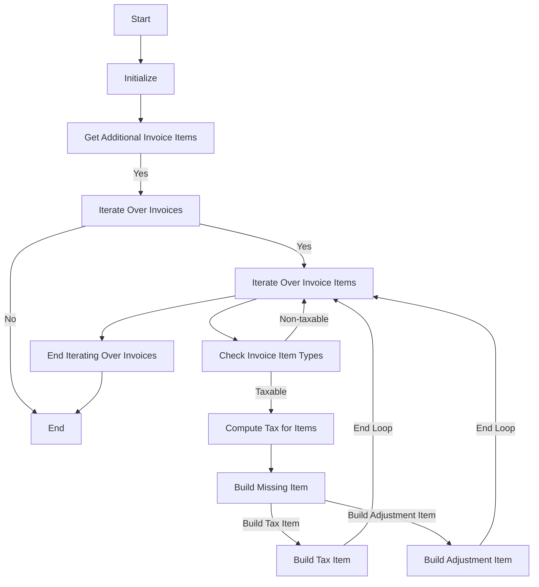

```mermaid
graph TD
  A[Start] --> B[Initialize]
  B --> C[Get Additional Invoice Items]
  C -->|Yes| D[Iterate Over Invoices]
  D -->|No| E[End]
  D -->|Yes| F[Iterate Over Invoice Items]
  F --> G[Check Invoice Item Types]
  G -->|Taxable| H[Compute Tax for Items]
  H --> I[Build Missing Item]
  I -->|Build Tax Item| J[Build Tax Item]
  I -->|Build Adjustment Item| K[Build Adjustment Item]
  K -->|End Loop| F
  J -->|End Loop| F
  G -->|Non-taxable| F
  F --> L[End Iterating Over Invoices]
  L --> E[End]
```